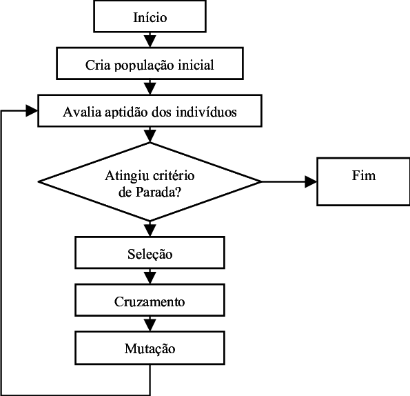

# Problem 2
## 🔍 Metaheuristics

Meta-heuristics are top-level concepts for exploring research spaces using different strategies.

## 🖥️ Servers and tasks

The 2nd problem consists of a set of programs with different execution times that will be run on several servers. </br>
 The objective of the problem is to find the combination of servers that allows to minimize the execution time of the programs using a heuristic goal.

## 🔑 Why genetic Algorithm?

It was decided to apply a genetic algorithm due to the nature of the problem as AG's are appropriate for complex optimization problems that evolve several variables. Generally, AG’s are a great choice as they can cover a large number of applications

## 📜 Flowchart

<p align="center"> 

## :construction_worker: How to run
```python
# Develop under python3
python3 servidores_and_tasks.py
```
